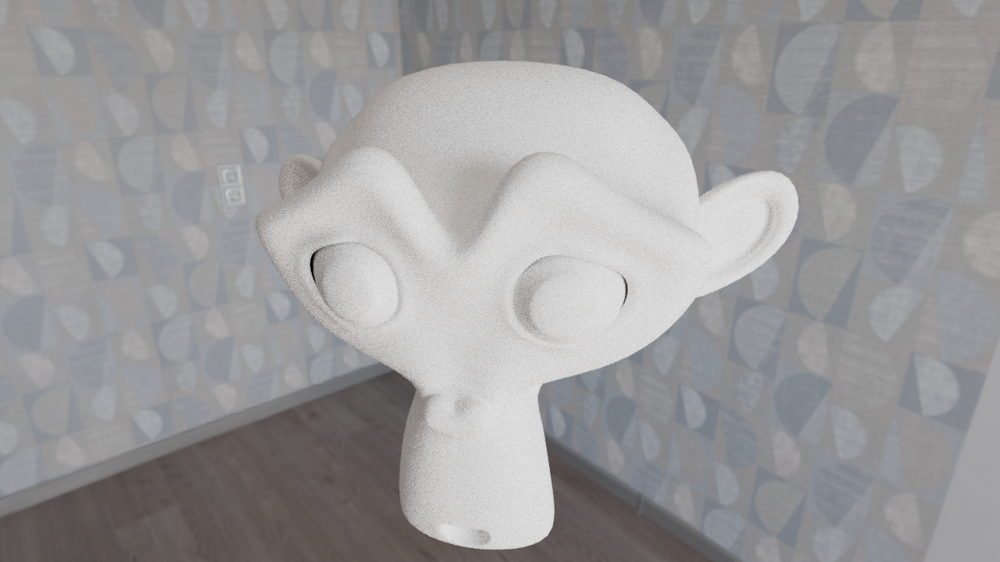

# 🦀 Rust Path Tracer

A high-performance CPU path tracer built from scratch in Rust. It implements Monte Carlo integration of the rendering equation, featuring Bounding Volume Hierarchy (BVH) acceleration and Importance Sampling for materials.

[](https://www.rust-lang.org/)
[](#color-pipeline)
[](#)
[](https://mkhl.dev/projects/raytracer)

---

## 📸 Render Showcase

### Suzanne (Blender Monkey)
Rendered at **512 samples per pixel** (1280x720) in **2 minutes** on CPU. Tone-mapped using Blender's Filmic compositor.



---
[See write up on my website](https://mkhl.dev/projects/raytracer)

## ⚡ Performance: Comparison with Blender Cycles

While Cycles uses advanced path-guiding and Multiple Importance Sampling (MIS) to converge cleaner at lower sample counts, this renderer executes raw sample calculations faster per-sample:

| Renderer | Time Per Pixel-Sample | Features Included |
| :--- | :--- | :--- |
| **This path tracer** | **271 ns** | Amortized BVH build, texture loads, ray casts |
| **Blender Cycles** | **388 ns** | Full production-grade rendering kernel |

---

## 🛠️ Technical Features

* **Monte Carlo Path Tracing**: Evaluates the rendering equation by recursively tracing rays and sampling the hemisphere.
* **BVH (Bounding Volume Hierarchy)**: Accelerates ray-triangle intersection tests, reducing rendering complexity from $O(N)$ to $O(\log N)$ where $N$ is the triangle count.
* **Importance Sampling**:
  * **Diffuse (Lambertian)**: Cosine-weighted hemisphere distribution, drastically reducing noise compared to uniform sampling.
  * **Specular (Mirror)**: Pure delta-distribution reflection vector calculation.
* **Color Pipeline**: Built on Rec. 709 linear color assumptions, exporting directly to high-dynamic-range **EXR** files for post-process tone mapping.

---

## 📐 The Rendering Equation

This renderer computes the outgoing radiance $L_o$ at surface point $\mathbf{x}$ in direction $\omega_o$ by solving the rendering equation numerically:

$$
L_o(\mathbf{x}, \omega_o) = L_e(\mathbf{x}, \omega_o) + \int_{\Omega} f(\mathbf{x}, \omega_i, \omega_o) L_i(\mathbf{x}, \omega_i) (\omega_i \cdot \mathbf{n}) d\omega_i
$$

### Monte Carlo Integration with Importance Sampling
To solve the integral, we sample light rays using a probability density function $p(\omega_i)$ matched to the material's BRDF $f$:

$$
\int f(x) dx \approx \frac{1}{N} \sum_{i=1}^{N} \frac{f(x_i)}{p(x_i)}, \quad x_i \sim p(x)
$$

For a diffuse material, we use a cosine-weighted distribution, simplifying the Monte Carlo estimate to:

$$
L_o(\mathbf{x}, \omega_o) \approx \frac{1}{N} \sum_{i=1}^{N} \text{albedo} \cdot L_i(\mathbf{x}, \omega_i)
$$

---

## 🚀 Running Locally

Ensure you have Rust and Cargo installed, then run the project in release mode:

```bash
# Build the project in release mode for maximum performance
cargo build --release

# Run the renderer (adjust CLI arguments based on your implementation)
cargo run --release -- -o output.png


